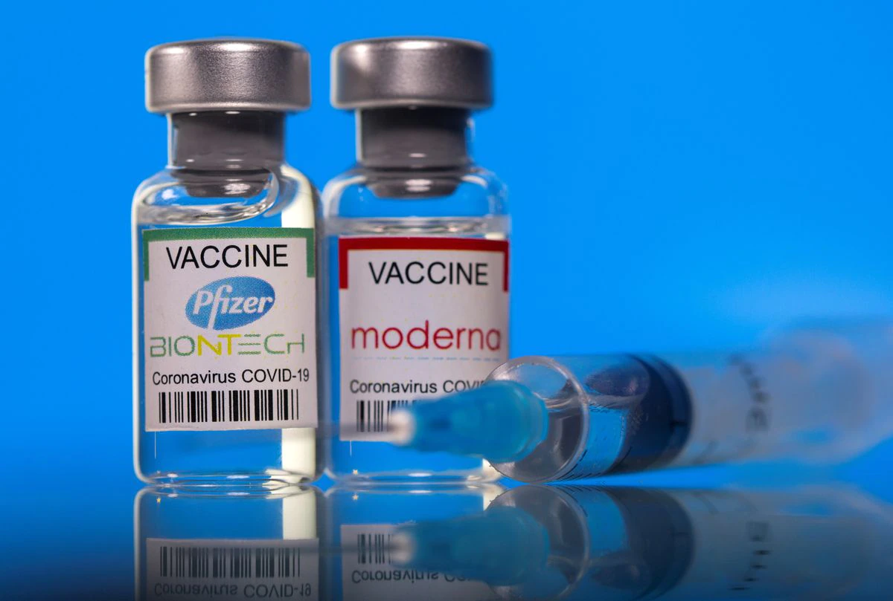

<!-- PROJECT SHIELDS -->
[![LinkedIn][linkedin-shield]][linkedin-url]
[![Jupyter][jupyter-shield]][jupyter-url]
[![Python][python-shield]][python-url]

## Vaccines, COVID & The Cure for Mistrust: Linguistic Analysis of Anti-vax on Social Media

  

### Overview
*[This project](https://github.com/PaulCaroline/comm313_S21_Final_Project/blob/main/final_data_story/final_blog_post.ipynb), which was completed for the class COMM 313, in the University of Pennsylvania's Annenberg School of Communications, is aimed at identifying differences in the way the the Anti-Vaccination movement on Twitter has changed since the start of the COVID-19 pandemic in 2020.*

### Organization & Directories
#### `data` folder📉 
* Stores two corpora of tweets dated either before or during the COVID-19 pandemic. The former corpus is located in the `pre_covid` folder, and is dated from January 2015 to January 2016. The latter corpus is located in the `post_covid` folder and is dated from March 2020 to May 2021.

#### `data_analysis` folder📈  
* Stores a series of notebook files containing procedures used to obtain, organize, and analyze the data to be presented in complete write-up located in the `final_data_story` folder.

#### `final_data_story` folder📖
* Includes a Jupyter Notebook, as well a any supplemental information that explains the results of the entire analysis in the form of a standalone blog. *Please navigate to this folder to access the conclusions of this study.*

#### `presentation` folder📊
* Contains the slides to a 3-5 minute presentation that was given in class prior to the completion of the project. A link to the recording may be found [here](https://upenn.zoom.us/rec/share/o0qQ3omU4LVlqQDOtYABd96meCLCS7VIlRJsvPDVKZnFXBjRy_gEEj4f_SPpRJgt.qJTEAQJlL_Jz0Riu?startTime=1619503767000).

### File Structure
📦comm313_S21_Final_Project  
 ┣ 📂data  
 ┃ ┣ 📂post_covid  
 ┃ ┣ 📂pre_covid   
 ┃ ┗ 📜README.md  
 ┣ 📂data_analysis  
 ┃ ┣ 📂.ipynb_checkpoints  
 ┃ ┣ 📜functions.ipynb  
 ┃ ┣ 📜main_corpus_data_retrieval.ipynb  
 ┃ ┣ 📜preliminary_analysis.ipynb  
 ┃ ┣ 📜preliminary_data_retrieval.ipynb  
 ┃ ┗ 📜README.md  
 ┣ 📂final_data_story  
 ┃ ┣ 📂res  
 ┃ ┣ 📜final_blog_post.ipynb  
 ┃ ┗ 📜README.md  
 ┣ 📂presentation  
 ┃ ┣ 📜Paul_Caroline_Presentation.pdf  
 ┃ ┗ 📜README.md  
 ┗ 📜README.md  
 
[linkedin-shield]: https://img.shields.io/badge/-LinkedIn-black.svg?style=for-the-badge&logo=linkedin&colorB=555
[linkedin-url]: https://www.linkedin.com/in/paul-caroline-336800142
[jupyter-shield]: https://img.shields.io/badge/Jupyter-F37626.svg?&style=for-the-badge&logo=Jupyter&logoColor=white
[jupyter-url]: https://jupyter.org/
[python-shield]: https://img.shields.io/badge/Python-3776AB?style=for-the-badge&logo=python&logoColor=white
[python-url]: https://www.python.org/
